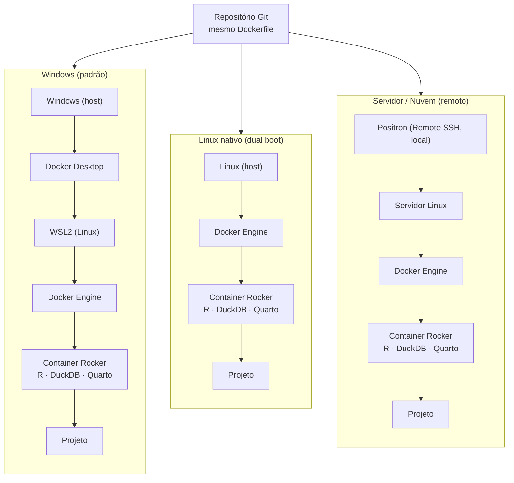

# Guia de Instalação – Perícia Contábil-Financeira

Este guia descreve os passos necessários para configurar o ambiente de desenvolvimento utilizado pela organização **Perícia Contábil-Financeira**.

A infraestrutura foi projetada para fornecer um ambiente reproduzível e padronizado para desenvolvimento de automações, análise de dados, exploração documental e Inteligência Artificial utilizando R, Python, DuckDB, Quarto e Docker.

Este guia descreve a instalação no **Windows**, que é o ambiente padrão da organização. Para casos periciais de grande porte, há também a opção de executar o mesmo projeto em **Linux nativo (dual boot)**, descrita no apêndice ao final.

---

# 0. Entender a Arquitetura

O ambiente é orientado por três princípios: **reprodutibilidade**, **portabilidade** e **escalabilidade operacional** (ver GOVERNANCA.md). Na prática, o projeto roda dentro de um container Docker baseado em Rocker, e o sistema operacional hospedeiro é apenas o anfitrião.

No **Windows**, o Docker Desktop usa uma camada Linux (WSL2) para executar os containers:

```text
Windows
 └─ Docker Desktop
      └─ WSL2 (Linux)
           └─ Container Rocker
                └─ Projeto
```

No **Linux nativo**, o Docker Engine usa diretamente o kernel do host, eliminando o Docker Desktop e o WSL2:

```text
Linux
 └─ Docker Engine
      └─ Container Rocker
           └─ Projeto
```

Como o ambiente está encapsulado no container Rocker, o mesmo repositório Git e o mesmo Dockerfile funcionam nos dois sistemas, sem reengenharia.

## Comparação das três pilhas de execução

O mesmo projeto (container Rocker) pode ser executado em diferentes hospedeiros. A portabilidade vem de manter o container constante e variar apenas o anfitrião:



Observações:

- **Windows** envolve três ambientes (Windows, WSL2 e o container) — uso padrão da organização.
- **Linux nativo** elimina o Docker Desktop e o WSL2, restando duas camadas (host e container).
- **Servidor/nuvem** mantém a interface (Positron) local via Remote SSH, enquanto arquivos e sessões rodam no host remoto.

---

# 1. Verificar o Computador

Antes de iniciar a instalação, verifique:

## Tipo de sistema

Verifique se o computador utiliza:

```text
x64 (AMD64)
```

ou

```text
ARM64
```

## Versão do Windows

Verifique se o sistema operacional é:

```text
Windows 10
```

ou

```text
Windows 11
```

Essas informações podem ser obtidas em:

```text
Configurações
→ Sistema
→ Sobre
```

ou pressionando:

```text
Windows + Pause
```

---

# 2. Criar Conta no GitHub

Caso ainda não possua uma conta:

https://github.com

Após criar a conta, informe seu usuário GitHub ao administrador da organização para receber o convite de acesso.

---

# 3. Instalar Git

Download:

https://git-scm.com/download/win

## Opções recomendadas durante a instalação

### Componentes

Selecionar:

```text
☑ Open Git Bash here
☐ Open Git GUI here
☑ Git LFS
☑ Associate .git*
☑ Associate .sh
☐ Check daily for updates
☑ Add Git Bash Profile to Windows Terminal
☐ Scalar
```

### Editor padrão

Selecionar:

```text
Use Notepad as Git's default editor
```

### Branch principal

Selecionar:

```text
Override the default branch name for new repositories
```

Informar:

```text
main
```

### PATH

Selecionar:

```text
Git from the command line and also from 3rd-party software
```

### SSH

Selecionar:

```text
Use bundled OpenSSH
```

### HTTPS

Selecionar:

```text
Use the native Windows Secure Channel library
```

### Line Endings

Selecionar:

```text
Checkout Windows-style, commit Unix-style line endings
```

### Terminal

Selecionar:

```text
Use Windows' default console window
```

### Git Pull

Selecionar:

```text
Fast-forward or merge
```

### Credential Helper

Selecionar:

```text
Git Credential Manager
```

### Opções Extras

Selecionar:

```text
☑ Enable file system caching
☐ Enable symbolic links
```

## Verificar instalação

Executar:

```powershell
git --version
```

---

# 4. Instalar Docker Desktop

Download:

https://www.docker.com/products/docker-desktop/

## Opções recomendadas

Selecionar:

```text
◉ All-users installation
```

e

```text
☑ Use WSL 2 instead of Hyper-V
☐ Allow Windows Containers
```

Também selecionar:

```text
☑ Add shortcut to desktop
```

## Após a instalação

Abrir o Docker Desktop.

Aguardar até aparecer:

```text
Docker is running
```

Verificar:

```powershell
docker info
```

Resultado esperado:

```text
Server:
...
```

### Verificações adicionais (opcional)

Verificar o WSL:

```powershell
wsl --status
```

Listar distribuições:

```powershell
wsl -l -v
```

Resultado esperado:

```text
docker-desktop
```

> Observação: no Windows, o Docker Desktop é necessário porque o sistema não executa containers Linux diretamente — ele depende da camada Linux do WSL2. No Linux nativo, o Docker Desktop não é necessário (ver apêndice).

---

# 5. Instalar Positron

Download:

https://positron.posit.co/

## Opções recomendadas

Selecionar:

```text
☐ Criar um atalho na área de trabalho

☑ Adicione a ação "Abrir com Positron" ao menu de contexto de arquivo
☑ Adicione a ação "Abrir com Positron" ao menu de contexto de diretório
☑ Registre Positron como um editor para tipos de arquivos suportados
☑ Adicione em PATH
```

Concluir a instalação.

---

# 6. Habilitar Dev Containers no Positron

Abrir o Positron.

Acessar:

```text
Manage
→ Settings
```

Pesquisar:

```text
dev container
```

Habilitar:

```text
Dev > Containers: Enable (Experimental)
```

Selecionar:

```text
☑ Dev > Containers: Enable (Experimental)
```

Fechar e reabrir o Positron.

---

# 7. Configurar Git

Executar:

```powershell
git config --global user.name "Seu Nome"
git config --global user.email "seu_email@dominio"
```

Exemplo:

```powershell
git config --global user.name "Claudio Riella"
git config --global user.email "cgriella@gmail.com"
```

Observações:

- O nome pode ser qualquer texto que identifique o autor dos commits.
- Recomenda-se utilizar um e-mail cadastrado no GitHub.

Verificar:

```powershell
git config --global --list
```

---

# 8. Clonar um Repositório

Criar uma pasta para armazenar os repositórios.

Exemplo:

```powershell
mkdir "C:\ProjetosGit"
cd "C:\ProjetosGit"
```

ou

```powershell
mkdir "C:\PCF Riella\Desktop\ProjetosGit"
cd "C:\PCF Riella\Desktop\ProjetosGit"
```

Clonar o repositório:

```powershell
git clone https://github.com/Pericia-Contabil-Financeira/patrimonial-financeiro.git
```

Na primeira execução será solicitada autenticação.

O Git Credential Manager abrirá automaticamente o navegador para autenticação no GitHub.

Após a autenticação:

```text
git clone
git pull
git push
```

normalmente funcionarão sem solicitar senha novamente.

---

# 9. Ajustar Política do PowerShell (Se Necessário)

Verificar:

```powershell
Get-ExecutionPolicy
```

Se retornar:

```text
Restricted
```

executar:

```powershell
Set-ExecutionPolicy -Scope CurrentUser RemoteSigned
```

Confirmar:

```text
A
```

(Yes to All)

Verificar novamente:

```powershell
Get-ExecutionPolicy
```

Resultado esperado:

```text
RemoteSigned
```

## Importante

Se a política de execução já estiver configurada corretamente (não estiver como `Restricted`), nenhuma ação adicional é necessária.

Essa configuração permite que o Positron execute os scripts temporários utilizados para criação automática dos Dev Containers.

Após a correção da política de execução, prossiga diretamente para a abertura do projeto no Positron.

---

# 10. Abrir o Projeto no Positron

Localize o diretório do projeto.

Exemplo:

```text
C:\ProjetosGit\patrimonial-financeiro
```

Clique com o botão direito sobre a pasta:

```text
Abrir com Positron
```

ou

```text
Open with Positron
```

Alternativamente:

```text
File
→ Open Folder
```

## Importante

Se a política do PowerShell estiver configurada corretamente, o Positron normalmente detectará automaticamente:

```text
.devcontainer
Dockerfile
```

e iniciará a construção da imagem Docker e do Dev Container sem necessidade de executar previamente:

```powershell
docker build
```

A primeira execução pode levar vários minutos devido ao download de imagens e instalação de dependências.

---

# 11. Criar o Dev Container

Ao abrir o projeto, o Positron identificará automaticamente:

```text
.devcontainer
Dockerfile
```

Selecionar:

```text
Reopen in Container
```

ou

```text
Open Folder in Container
```

Durante esse processo poderão ser criadas:

```text
Imagem Docker do Projeto
Imagem Dev Container
Container Docker
```

A primeira execução pode levar vários minutos.

---

# 12. Configurar Git Dentro do Container

Após o Dev Container iniciar, abrir o terminal do Positron.

Configurar:

```bash
git config --global user.name "Seu Nome"
git config --global user.email "seu_email@dominio"
```

Exemplo:

```bash
git config --global user.name "Claudio Riella"
git config --global user.email "cgriella@gmail.com"
```

Verificar:

```bash
git config --global --list
```

Observação:

O Git instalado dentro do container Linux possui configuração própria e independente do Git instalado no Windows.

---

# 13. Testar o Ambiente

No console R:

```r
sessionInfo()
```

Verificar:

```text
R version 4.x
```

Verificar diretório:

```r
getwd()
```

Resultado esperado:

```text
/workspaces/nome-do-projeto
```

Testar pacotes:

```r
library(data.table)
library(duckdb)
library(arrow)

print("Ambiente R OK")
```

Verificar versão do Python:

```bash
python --version
```

---

# 14. Atualizar e Enviar Alterações

Atualizar o repositório:

```bash
git pull
```

Adicionar alterações:

```bash
git add .
```

Criar commit:

```bash
git commit -m "Descrição da alteração"
```

Enviar alterações:

```bash
git push
```

Também é possível utilizar a interface gráfica do Positron:

```text
Source Control
→ Commit
→ Push
```

---

# 15. Solução de Problemas

## Docker não inicia

Verificar:

```powershell
docker info
```

Se não houver seção:

```text
Server:
```

o Docker Desktop provavelmente ainda não terminou de iniciar.

---

## Git não reconhece o usuário

Executar:

```bash
git config --global user.name "Seu Nome"
git config --global user.email "seu_email@dominio"
```

Verificar:

```bash
git config --global --list
```

---

## Positron não abre o Dev Container

Verificar:

```powershell
Get-ExecutionPolicy
```

Se retornar:

```text
Restricted
```

executar:

```powershell
Set-ExecutionPolicy -Scope CurrentUser RemoteSigned
```

---

## Verificar containers ativos

```powershell
docker ps
```

---

## Verificar todos os containers

```powershell
docker ps -a
```

---

## Verificar imagens instaladas

```powershell
docker images
```

---

## Verificar o status do WSL

```powershell
wsl --status
```

---

# Estrutura dos Repositórios

```text
Projeto/
├── R/
├── Python/
├── Documentos/
├── Dados/
├── Saidas/
├── Relatorios/
├── .devcontainer/
├── Dockerfile
├── README.md
└── *.Rproj
```

---

# Organização dos Diretórios

## R/

Contém scripts desenvolvidos em linguagem R.

## Python/

Contém scripts desenvolvidos em linguagem Python.

## Documentos/

Contém os documentos originais do caso.

O GitHub NÃO realiza upload dessa pasta.

## Dados/

Contém os dados estruturados produzidos a partir dos documentos.

O GitHub NÃO realiza upload dessa pasta.

## Saidas/

Contém os resultados gerados pelos scripts.

O GitHub NÃO realiza upload dessa pasta.

## .devcontainer/

Configura o ambiente Docker utilizado pelo Positron.

## Dockerfile

Define os componentes instalados automaticamente no ambiente.

## README.md

Documento principal do projeto.

## *.Rproj

Arquivo de projeto utilizado pelo Positron.

---

# Importante

Não enviar ao GitHub:

- PDFs;
- Planilhas;
- Quebras de sigilo;
- Bases SIMBA;
- Declarações fiscais;
- Bancos DuckDB;
- Dados pessoais;
- Relatórios periciais;
- Arquivos de procedimentos;
- Qualquer documento sensível.

O GitHub deve ser utilizado apenas para compartilhamento de:

- Scripts;
- Modelos;
- Automações;
- Documentação técnica;
- Boas práticas;
- Estruturas reutilizáveis.

---

# Tecnologias Utilizadas

- GitHub
- Git
- Docker Desktop
- Positron
- Dev Containers
- R
- Python
- DuckDB
- Quarto
- Inteligência Artificial

---

# Apêndice – Linux Nativo (Dual Boot) para Casos de Grande Porte

Esta seção é **opcional** e voltada a cenários em que o ambiente Windows se torne um gargalo (por exemplo, casos com muitos PDFs, OCR massivo ou tabelas DuckDB muito grandes). A configuração padrão da organização continua sendo o Windows.

## Por que considerar Linux nativo

Em casos periciais de grande porte, o Windows pode "engasgar" pela concorrência de recursos entre o sistema operacional, o Docker Desktop, o WSL2, o antivírus, o OneDrive, o Teams, o navegador e os sistemas corporativos.

Iniciar a **mesma máquina** em Linux nativo (dual boot) tende a melhorar:

- uso de memória;
- estabilidade e responsividade;
- desempenho de leitura e escrita em disco (I/O);
- manipulação de grande volume de arquivos;
- processamento de PDFs, OCR e DuckDB.

Não se espera um ganho dramático de CPU. O principal benefício é operacional: simplicidade (uma camada Linux a menos, sem WSL2/Docker Desktop) e melhor aproveitamento do hardware sob carga pesada.

Como o ambiente está encapsulado no container Rocker, a migração usa o **mesmo repositório Git e praticamente o mesmo Dockerfile** — apenas `git pull` e subir o container.

## Distribuição recomendada

Recomenda-se **Ubuntu 24.04 LTS** pela combinação de compatibilidade, documentação, suporte oficial ao Docker e maior facilidade com VPN corporativa. Alternativas estáveis: Linux Mint (Cinnamon), Debian e Fedora Workstation.

## Antes de adotar dual boot

O maior risco da migração para Linux não costuma ser o Positron ou o Docker, e sim a **infraestrutura corporativa**. Verifique:

- **VPN corporativa:** o Cisco AnyConnect (Cisco Secure Client) possui versão para Linux (Ubuntu/RHEL). Validar autenticação adicional (certificados, MFA, posture).
- **Certificados corporativos:** podem precisar ser instalados também no Linux.
- **Sistemas internos e Office:** confirmar acesso a Outlook, Teams, assinadores e sistemas internos (eventualmente via versões web).

Uma forma de validar sem mexer no disco é criar um **pendrive Ubuntu em modo Live**, instalar a VPN e testar o acesso aos sistemas internos antes de instalar o dual boot definitivo.

## Instalação do Docker no Linux

No Linux nativo **não** é necessário o Docker Desktop. Instala-se apenas o Docker Engine:

```bash
sudo apt update
sudo apt install docker.io docker-compose-plugin git
```

Recomenda-se preferir os pacotes oficiais do repositório da Docker. Em seguida:

```bash
docker ps
docker images
docker compose up
```

A partir daí, o fluxo de trabalho com Positron, Git e o Dev Container Rocker é equivalente ao do Windows.

---

# Apêndice – Benchmarks Futuros

A hipótese de que o Linux nativo é mais eficiente que o Windows para o mesmo hardware **ainda não foi validada empiricamente**. Esta seção propõe um protocolo simples para coletar evidências antes de adotar o dual boot como prática.

## Objetivo

Comparar, na **mesma máquina** e com o **mesmo caso de teste**, o desempenho entre:

- **Windows** + Docker Desktop + WSL2 + Rocker;
- **Linux nativo** + Docker Engine + Rocker.

## Princípios da medição

Para que a comparação seja justa:

- Usar o **mesmo container Rocker** (mesmo Dockerfile/imagem) nos dois sistemas;
- Usar o **mesmo conjunto de dados** (mesmos PDFs/planilhas), de preferência fictícios ou anonimizados;
- Repetir cada medição **3 a 5 vezes** e registrar a mediana (evita ruído de cache e processos em segundo plano);
- Registrar o "primeiro acesso" (disco frio) separadamente do "acesso repetido" (cache quente);
- Documentar o hardware e o estado do sistema (programas abertos, antivírus, OneDrive em sincronização etc.).

## Métricas sugeridas

| Métrica | O que medir | Como coletar |
|---|---|---|
| Tempo de OCR | Tempo total para processar um lote fixo de PDFs | Cronometrar o script de OCR ponta a ponta |
| Ingestão de PDFs | Tempo para extrair texto/dados de N PDFs | Cronometrar a etapa de extração |
| Consultas DuckDB | Tempo de consultas representativas sobre tabela grande | Cronometrar queries fixas |
| Geração de relatório | Tempo de render de um documento Quarto | Cronometrar `quarto render` |
| Uso de RAM | Pico de memória durante o processamento | Monitor de recursos / `docker stats` |
| Uso de CPU | Utilização média e pico | Monitor de recursos / `docker stats` |
| Throughput de disco (I/O) | Leitura/escrita durante OCR e DuckDB | Monitor de recursos do sistema |
| Volume de arquivos | Tempo para copiar/indexar muitos arquivos pequenos | Cronometrar a operação de varredura |

## Exemplos de coleta

Cronometrar uma etapa em R:

```r
tempo <- system.time({
  # etapa a medir: OCR, ingestão de PDFs, consulta DuckDB etc.
})
print(tempo)
```

Cronometrar a renderização de um relatório Quarto (terminal):

```bash
/usr/bin/time -v quarto render relatorio.qmd
```

Acompanhar uso de CPU/RAM do container durante a execução:

```bash
docker stats
```

## Registro dos resultados

Sugere-se manter uma planilha ou tabela versionada (sem dados sensíveis) com colunas como:

```text
data | sistema (Windows/Linux) | hardware | caso de teste | métrica | execução (1..n) | valor | observações
```

## Critério de decisão

O dual boot passa a se justificar de forma objetiva quando, para casos de grande porte, o Linux apresentar de forma **consistente** (mediana sobre repetições):

- redução relevante no tempo total de processamento; **ou**
- estabilidade/responsividade claramente superior (menos travamentos sob carga); **ou**
- menor pico de uso de memória que evite saturação.

Enquanto não houver essas evidências, o dual boot deve ser tratado como **plano B estratégico** para casos excepcionais, não como recomendação geral.

---

# Suporte

Em caso de dúvidas, entre em contato com os administradores da organização.

Bem-vindo à comunidade Perícia Contábil-Financeira.
