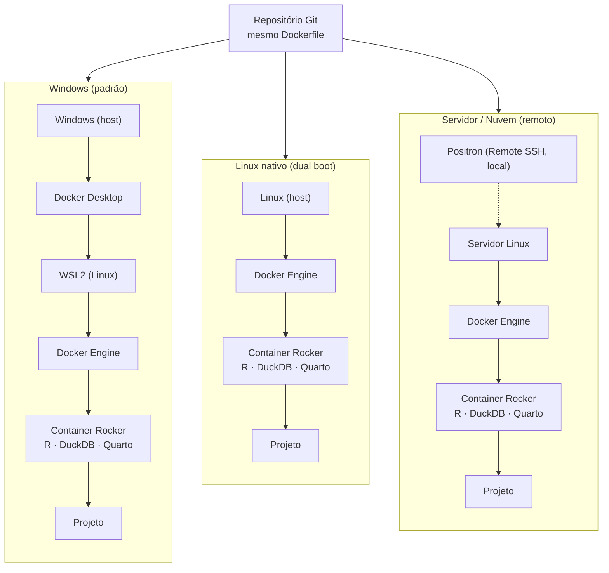

# Perícia Contábil-Financeira

Organização colaborativa para compartilhamento de scripts, modelos, automação, IA e boas práticas aplicadas à perícia contábil-financeira.

## Objetivo

Criar um espaço comum para desenvolvimento e compartilhamento de ferramentas de apoio à atividade pericial da Área 1, com foco em:

- Automação de rotinas;
- Exploração e análise de dados;
- Organização documental;
- Localização de evidências;
- Relatórios reproduzíveis;
- Desenvolvimento assistido por IA;
- Compartilhamento de scripts e boas práticas.

## Como Participar

1. Criar uma conta no GitHub;
2. Solicitar inclusão na organização;
3. Instalar Git, Docker Desktop e Positron;
4. Seguir o Guia de Instalação;
5. Clonar o repositório da área de interesse;
6. Compartilhar scripts, automações e boas práticas.

## Documentação

- [Guia de Instalação](https://github.com/Pericia-Contabil-Financeira/.github/blob/main/GUIA-INSTALACAO.md)
- [Governança](https://github.com/Pericia-Contabil-Financeira/.github/blob/main/GOVERNANCA.md)
- [Como Contribuir](https://github.com/Pericia-Contabil-Financeira/.github/blob/main/CONTRIBUICAO.md)
- [Perguntas Frequentes (FAQ)](https://github.com/Pericia-Contabil-Financeira/.github/blob/main/FAQ.md)

## Áreas

- Patrimonial e Financeiro
- Licitações
- Exame Contábil
- Entidade Pública
- Mercado de Capitais
- RPPS
- Avaliação de Empresas e Investimentos
- Gestão Fraudulenta e/ou Temerária de Instituições Financeiras

## Infraestrutura

Os repositórios utilizam uma estrutura comum baseada em:

- Docker
- Positron
- R
- Python
- DuckDB
- Quarto
- Git / GitHub
- Inteligência Artificial

## Princípios Arquiteturais

A infraestrutura da organização é orientada por três princípios centrais, que justificam o uso de Docker/Rocker, Git, DuckDB, Quarto e scripts versionados:

### Reprodutibilidade

Capacidade de executar o projeto em momentos, máquinas e ambientes diferentes obtendo o mesmo comportamento técnico esperado. Em vez de depender de instalações manuais em cada computador, o ambiente é descrito e versionado (Docker/Rocker, Git, DuckDB, Quarto). Isso reduz erros, incompatibilidades de versão e tempo de preparação do ambiente.

### Portabilidade

Capacidade de mover o projeto entre diferentes ambientes de execução sem reengenharia. O mesmo repositório e o mesmo Dockerfile podem ser executados em Windows com Docker Desktop, em Linux nativo com Docker Engine, em servidor Linux ou em nuvem (por exemplo, Azure). O container Rocker passa a ser o "computador" da aplicação, e o sistema operacional hospedeiro torna-se apenas o anfitrião.

### Escalabilidade Operacional

Capacidade de adaptar o ambiente de execução ao tamanho e à complexidade do caso pericial sem alterar a arquitetura. Escalar não significa apenas adquirir hardware mais potente: também envolve escolher o ambiente operacional mais eficiente para cada situação (por exemplo, iniciar a mesma máquina em Linux nativo via dual boot quando o ambiente Windows se tornar um gargalo).

Os três princípios se encadeiam: sem reprodutibilidade, cada ambiente exigiria configuração própria; sem portabilidade, o projeto ficaria preso a uma máquina ou sistema operacional. Assim, **reprodutibilidade + portabilidade = base para escalabilidade operacional**.

### Pilhas de execução

O mesmo projeto (container Rocker) pode ser executado em diferentes hospedeiros. A portabilidade vem de manter o container constante e variar apenas o anfitrião:

- **Windows** envolve três ambientes (Windows, WSL2 e o container) — uso padrão da organização.
- **Linux nativo** elimina o Docker Desktop e o WSL2, restando duas camadas (host e container).
- **Servidor/nuvem** mantém a interface (Positron) local via Remote SSH, enquanto arquivos e sessões rodam no host remoto.

## Segurança

Não devem ser enviados ao GitHub:

- Dados reais de procedimentos;
- PDFs;
- Planilhas;
- Quebras de sigilo;
- Bases SIMBA;
- Declarações fiscais;
- Bancos DuckDB;
- Relatórios periciais;
- Qualquer documento sensível.

O GitHub deve ser utilizado apenas para scripts, modelos, documentação técnica e estruturas reutilizáveis.

## Repositórios

### Infraestrutura

- `automacao-pericial`

### Áreas Temáticas

- `patrimonial-financeiro`
- `licitacoes`
- `exame-contabil`
- `entidade-publica`
- `mercado-capitais`
- `rpps`
- `avaliacao-empresas-investimentos`
- `gestao-fraudulenta-instituicoes-financeiras`

## Tecnologias

- R
- Python
- SQL
- DuckDB
- Docker
- Git
- GitHub
- Quarto
- Positron
- Inteligência Artificial
- Retrieval-Augmented Generation (RAG)

## Visão

A proposta da organização é fomentar a colaboração entre peritos da Área 1, permitindo o compartilhamento de conhecimento, automações, modelos de análise e boas práticas, reduzindo retrabalho e acelerando o desenvolvimento de soluções aplicadas à perícia contábil-financeira.

## Princípios

- Reprodutibilidade;
- Portabilidade;
- Escalabilidade operacional;
- Colaboração;
- Transparência técnica;
- Compartilhamento de conhecimento;
- Segurança da informação;
- Desenvolvimento contínuo.

## Licença

Salvo disposição em contrário indicada em cada repositório, os materiais disponibilizados destinam-se ao compartilhamento de conhecimento técnico e desenvolvimento colaborativo entre os participantes da organização.
